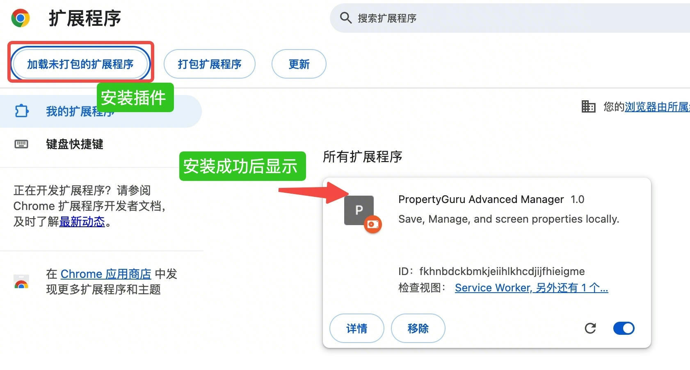
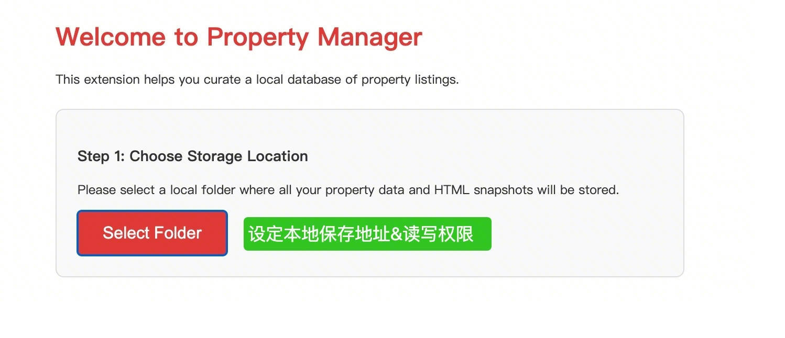
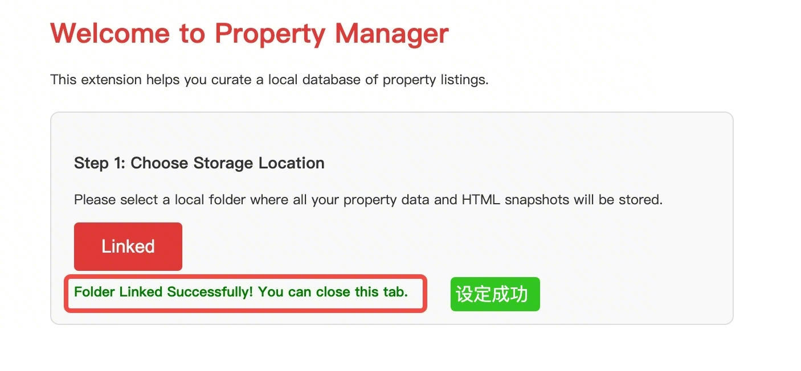
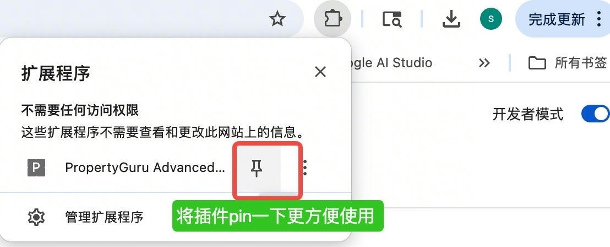
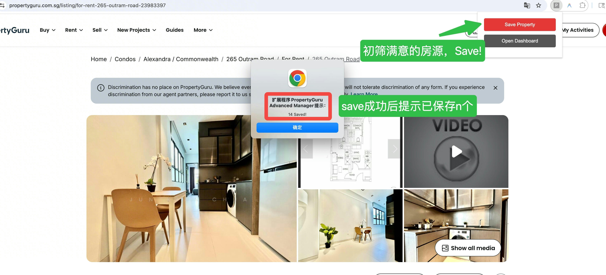
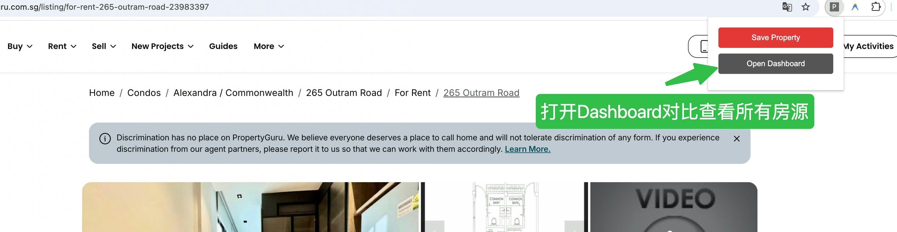
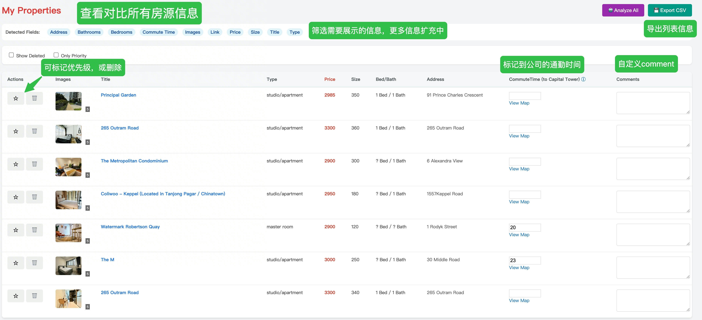

# Property Manager 插件使用说明与功能介绍

你是否厌倦了在 PropertyGuru 上查看房源信息时的繁琐操作？
你是否希望能统一对比所有感兴趣的房源信息？

这是一个用于增强 PropertyGuru 筛房体验的 Chrome 浏览器插件。它可以自动提取房源的关键信息，以表格形式清晰展示，并提供轻便的筛选、管理和导出功能。

## 主要功能

*   **自动提取房源信息**：自动抓取 Shortlist 页面中的 Price, Size, Bed/Bath, Address, Title, Type 等核心数据。
*   **交互式数据面板**：
    *   **动态列展示**：点击顶部的蓝色的 "Detected Fields" 标签（如 `[Price]`, `[Size]`, `[Images], [Address]`等），可以一键显示或隐藏对应的表格列。
    *   **房源图片查看器**：点击表格中的房源图片，可以通过灯箱（Lightbox）模式大图浏览该房源的所有提取图片。
*   **通勤时间计算**：
    *   表格中包含 "CommuteTime" 列。
    *   点击 "View Map" 可直接跳转 Google Maps 查看路线。
    *   支持手动输入通勤时间（分钟），系统会自动保存。
*   **数据管理**：
    *   **本地保存**：数据安全地存储在您选定的本地文件夹中，不会丢失。
    *   **CSV 导出**：支持一键将整理好的房源数据导出为 Excel 可用的 CSV 文件。
    *   **备注与标记**：支持给房源添加备注（Comments），标记为“星标”（Priority），或“逻辑删除”（Delete）。

## 简易版图片教程

### 1. 加载插件

### 2. 初始化设置

### 3. 关联文件夹

### 4. 固定插件图标

### 5. 保存房源

### 6. 打开管理面板

### 7. 数据面板概览

## 详细版安装步骤&使用指南

1.  **准备环境**：
    *   确保您安装了 Google Chrome 浏览器。
    *   下载该仓库 `git clone https://github.com/shijin522/property_extension.git`

2.  **加载插件**：
    *   在 Chrome 地址栏输入 `chrome://extensions` 并回车。
    *   开启右上角的 **"开发者模式" (Developer mode)** 开关。
    *   点击左上角的 **"加载已解压的扩展程序" (Load unpacked)** 按钮。
    *   选择下载的 `property_extension` 文件夹。
    *   加载成功后，您应该能在扩展栏看到插件图标，pin一下更方便使用。

3.  **初始化房源信息本地保存地址**
    *   安装完插件后，会弹出"Welcome to Property Manager"初始介绍页（放置setup.jpeg图片）
    *   在介绍页中，点击 "Setup / Link Folder"，选择一个本地文件夹（建议新建一个空文件夹，例如 `my_property_data`）用于存放数据。
    *   授权浏览器对该文件夹的读写权限。
    

4.  **浏览房源并本地保存数据**：
    *   打开 PropertyGuru 的 房源页面。
    *   点击插件图标，点击 "Save Property" 按钮，会将当前房源信息保存到本地

5.  **统一查看房源信息**
    *   点击插件图标，点击 "Open Dashboard" 按钮，会打开一个表格，展示所有已保存的房源信息。
    *   打开Dashboard后，会自动分析提取所有房源信息，包括 Price, Size, Bed/Bath, Address, Title, Type 等核心数据

6.  **日常管理**：
    *   在表格中查看对比房源。
    *   **隐藏/显示列**：觉得列太多太乱？点击顶部的蓝色标签把不需要的列（如 Size 或 Images）点灰即可隐藏。
    *   **查看&输入通勤时间**：在 CommuteTime 列，包含谷歌地图从该房源到capital tower的链接，支持手动输入通勤时间，等 google map api接入成功后增加获取通勤时间功能
    *   **导出**：需要做进一步分析或分享给其他人/中介时，点击右上角的 "Export CSV" 按钮。

## 注意事项

*   插件完全在本地运行，您的数据文件保存在您指定的本地文件夹中，不会上传到服务器。
*   如需分享给他人使用，只需发送整个文件夹，并通过上述"安装步骤"加载即可。
